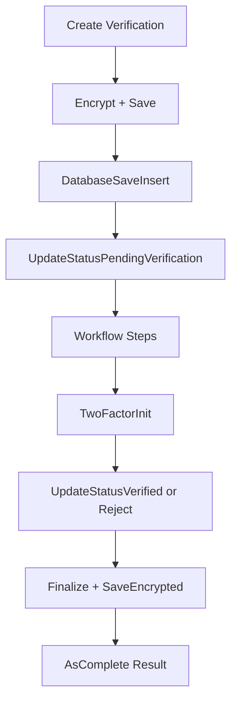

# Verify Package Overview

The `verify` package provides a complete verification lifecycle system, including
storage, database persistence, encryption, workflow steps, and two-factor handling.

---

## **Verification Lifecycle**
- **`Create`** – Creates a new verification with UUID, keys, initial status, steps, transaction, and encrypted payload.  
- **`AgentLoad` / `Load` / `ShareLoad`** – Load verification data from storage, optionally decrypting with private key.  
- **`Save` / `Finalize` / `SaveEncrypted`** – Persist verification to storage (plain JSON, finalized state, or encrypted).  
- **`Delete` / `DeleteEncrypted`** – Remove verification files from storage.  
- **`LoadEncrypted`** – Decrypts and loads the encrypted verification data from storage.  

---

## **Database Operations**
- **`DatabaseSaveInsert`** – Inserts verification into the DB (`models.Verify`).  
- **`DatabaseSaveVerify`** – Updates verification record in the DB.  
- **`DatabaseUpdate`** – Wrapper that calls `DatabaseSaveVerify`.  

---

## **Status Updates**
- **`UpdateStatusPendingVerification`**  
- **`UpdateStatusInProgress`**  
- **`UpdateStatusEscalate`**  
- **`UpdateStatusVerified`**  
- **`UpdateStatusReject`**  
- **`UpdateStatusExpired`**  
Each transitions the verification’s state, logs the change, adds a step, and persists to DB/storage.  

---

## **Steps / Workflow**
- **`StepsInit`** – initialize steps.  
- **`AddStep`** – append a workflow step.  
- **`IncrementStep`** – move forward in process.  
- **`CountStepsOfType`** – count occurrences of a given step type.  
- **`panicReject`** – special fail-safe rejection flow.  

---

## **Data Management**
- **`DataInit`** – initialize empty data object for the verification’s type.  
- **Setters:**  
  - `SetDataPhone`  
  - `SetDataEmail`  
  - `SetDataFACE`  
  - `SetDataIDEN`  
  - `SetDataADDR`  
  - `SetDataCRCD`  
- **`GetDataMasked`** – return masked version of sensitive data for display.  

---

## **Encryption**
- **`EncryptedInit`** – initialize `Encrypted` struct and transaction.  
- **`LoadEncrypted`** – load/decrypt encrypted JSON.  
- **`SaveEncrypted`** – encrypt and store JSON with public key.  

---

## **Two-Factor**
- **`TwoFactorInit`** – generate and attach a two-factor code if required.  
- **`TwoFactorVerify`** – validate submitted code, reject/expire if invalid, verify if correct.  

---

## **Transactions**
- **`TransactionPublicInit`** – initialize public-facing transaction fields.  
- **`TransactionPrivateInit`** – initialize private transaction fields.  
- **`TransactionApproved`** – populate full approved transaction data (public + private).  

---

## **Helpers**
- **`Updated`** – refreshes the `UpdatedAt` timestamp.  
- **`ObjectName`** – returns filename for storage (`uuid.json` / `uuid.encrypted.json`).  
- **`AsComplete`** – returns a stripped-down `VerificationComplete` struct for final results.  
- **Logging:**  
  - `LogInfo` – wrapper around `app.Log.Info`.  

---

## **High-Level Flow**

